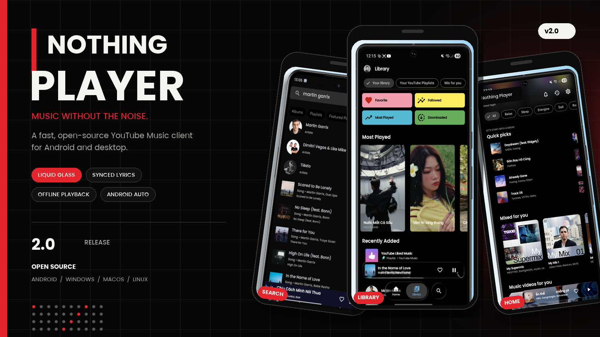
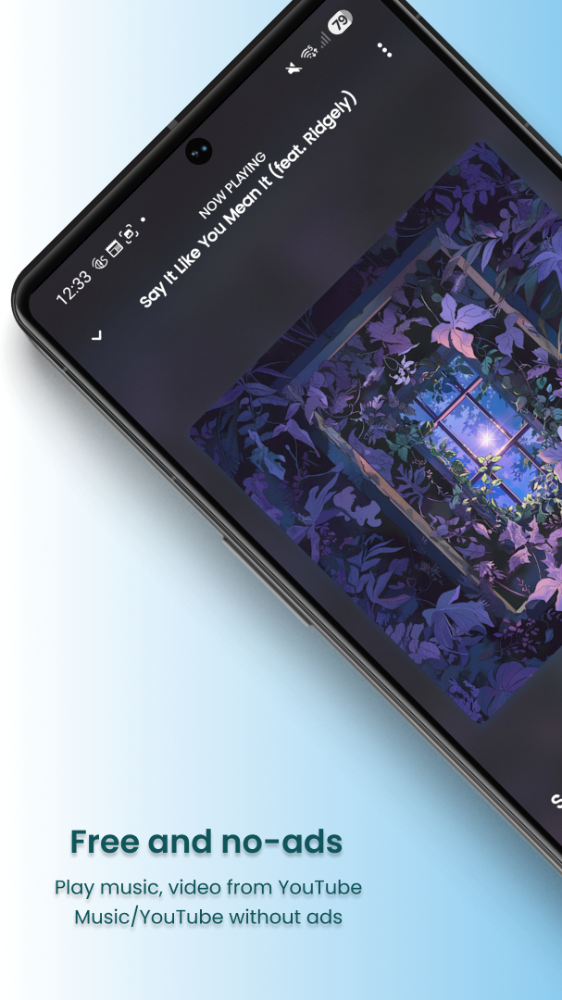
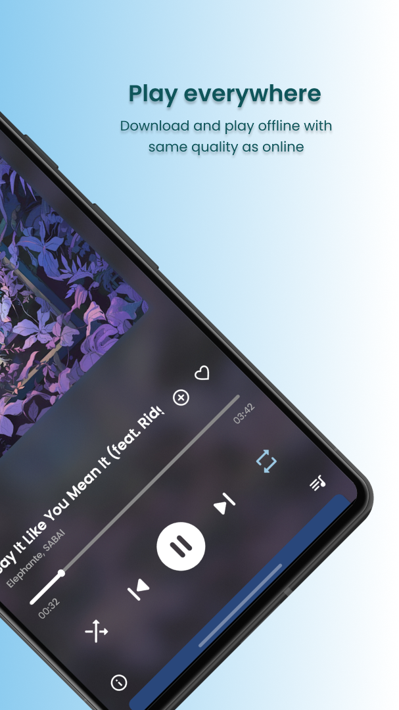
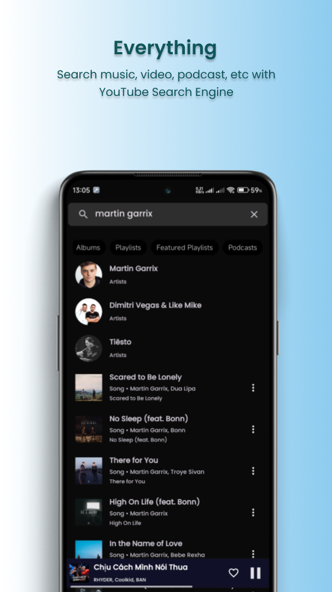
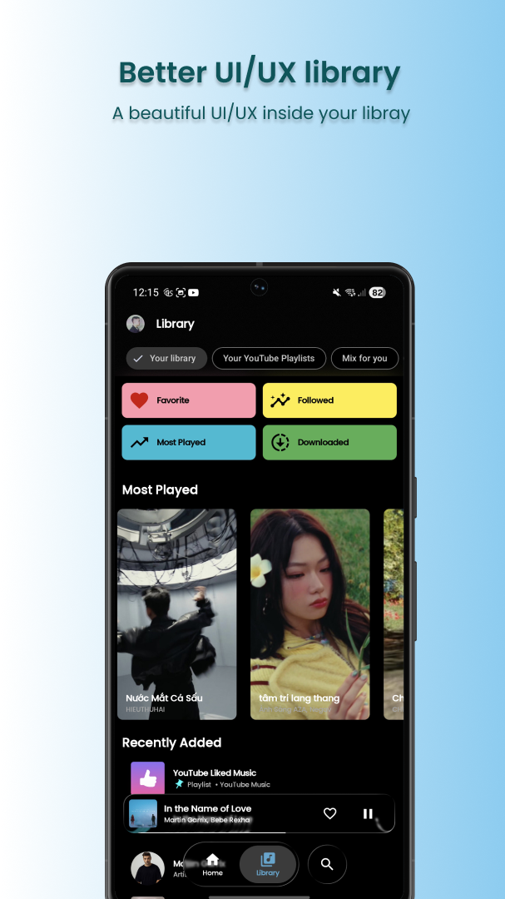

<div align="center">



# Nothing Player

An open-source YouTube Music client for Android and desktop, built with Kotlin and Compose Multiplatform.

[](https://github.com/iniharith/Nothing-Player/releases/latest)
[](https://github.com/iniharith/Nothing-Player/actions/workflows/android-release.yml)
[](LICENSE)
[](https://kotlinlang.org/)

[Download v2.0](https://github.com/iniharith/Nothing-Player/releases/tag/v2.0) · [Report a bug](https://github.com/iniharith/Nothing-Player/issues/new) · [View source](https://github.com/iniharith/Nothing-Player)

</div>

## Overview

Nothing Player brings music discovery, playback, lyrics, offline listening, and system integrations into one fast client. It supports YouTube Music and YouTube content while keeping the interface native across Android and desktop.

| Playback | Discovery | Experience |
| --- | --- | --- |
| Background and offline playback | Home, charts, podcasts, moods, and genres | Liquid-glass interface and custom themes |
| Crossfade and configurable audio quality | YouTube-wide search and recommendations | Synced lyrics and optional AI translation |
| Video playback with subtitle support | Followed-artist release notifications | Android Auto and Discord Rich Presence |
| SponsorBlock and Return YouTube Dislike | Playlist and multi-account support | Last.fm scrobbling and sleep timer |

Additional capabilities include Spotify Canvas, caching, local playlists, personalized recommendations, and up to 256 kbps audio for eligible YouTube Music Premium accounts.

## Download

The latest stable Android release is available on the [GitHub Releases page](https://github.com/iniharith/Nothing-Player/releases/latest).

| APK | Recommended for |
| --- | --- |
| `arm64-v8a` | Most modern Android phones and tablets |
| `armeabi-v7a` | Older 32-bit Android devices |
| `x86_64` | Android emulators and compatible x86 devices |
| `universal` | Use when the device architecture is unknown |

Android 8.0 (API 26) or newer is required. Existing installations can update directly when signed with the same Nothing Player release certificate.

Desktop targets are maintained for Windows, macOS, and Linux. Desktop packages appear in a release when platform signing is available.

## Screenshots

<p align="center">
  
  
  
  
</p>

## Build From Source

Requirements:

- JDK 21
- Android SDK and Android Studio for Android builds
- Git with submodule support

Clone the repository with its submodules:

```bash
git clone --recurse-submodules https://github.com/iniharith/Nothing-Player.git
cd Nothing-Player
```

Build an Android debug APK:

```bash
./gradlew :androidApp:assembleDebug
```

On Windows, use `gradlew.bat` instead of `./gradlew`. Release builds require a local signing configuration; signing keys and `keystore.properties` must never be committed.

## Full And FOSS Builds

Nothing Player provides two Android build variants:

| Build | Crash reporting | Intended use |
| --- | --- | --- |
| Full | Sentry crash reporting | Helps diagnose production crashes |
| FOSS | No third-party crash reporting | Privacy-focused and reproducible builds |

Neither variant hosts audio or video. Media is requested from the original content platforms.

## Data And Privacy

Nothing Player communicates with YouTube Music and related services to search, browse, and play media. Optional features may use Spotify, Last.fm, LRCLIB, SponsorBlock, Return YouTube Dislike, OpenAI, or Gemini.

The FOSS build does not include third-party crash reporting. The Full build sends crash diagnostics to Sentry. Listening history is sent to Google only when a signed-in user enables the relevant synchronization behavior.

## Legal

Nothing Player is an independent, non-commercial, open-source client. It is not affiliated with, endorsed by, or sponsored by Google, YouTube, Spotify, or Nothing Technology Limited.

The project does not host, upload, or distribute copyrighted audio or video. Content remains on the original provider's infrastructure. Users are responsible for complying with applicable laws and the terms of the services they access. Supporting artists through official subscriptions, including YouTube Premium, is strongly encouraged.

The software is provided "AS IS", without warranty of any kind. See the [GPL-3.0 license](LICENSE) for the full software terms.

## Credits

Nothing Player builds on ideas and services from the open-source music community, including [InnerTune](https://github.com/z-huang/InnerTune), [SmartTube](https://github.com/yuliskov/SmartTube), [SponsorBlock](https://sponsor.ajay.app/), [Return YouTube Dislike](https://returnyoutubedislike.com/), and [LRCLIB](https://lrclib.net/).

## Contributing

Issues and pull requests are welcome. Please read the [Code of Conduct](CODE_OF_CONDUCT.md) before contributing.

<a href="https://github.com/iniharith/Nothing-Player/graphs/contributors">
  
</a>

---

<div align="center">
Built for listeners who want control over their player.
</div>
